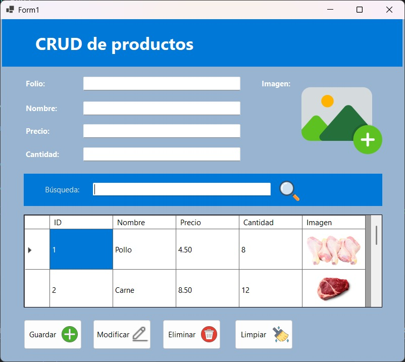
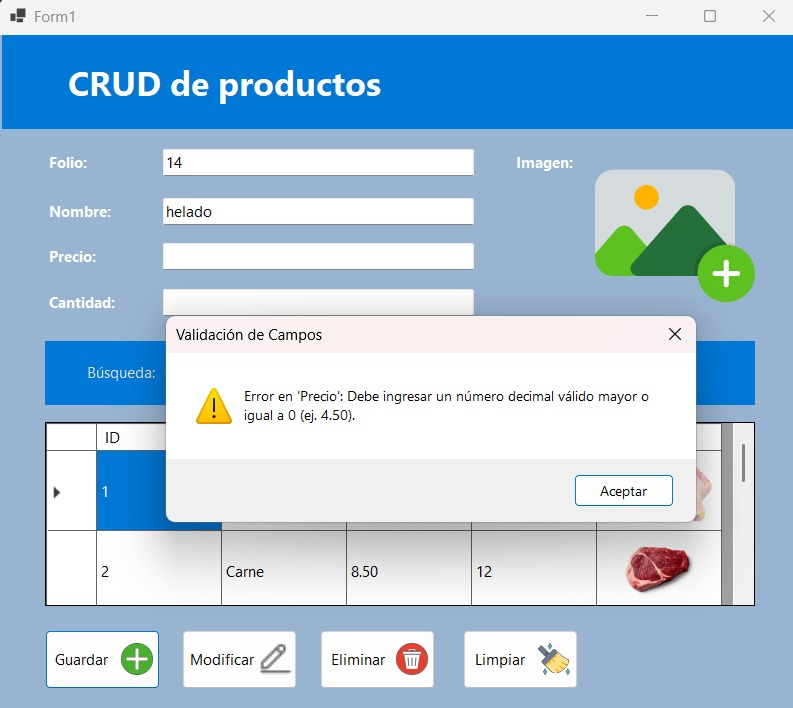
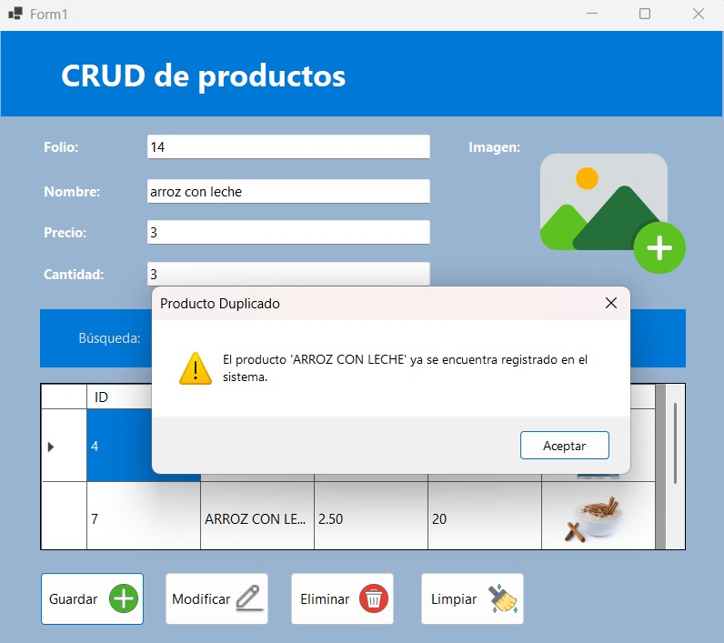
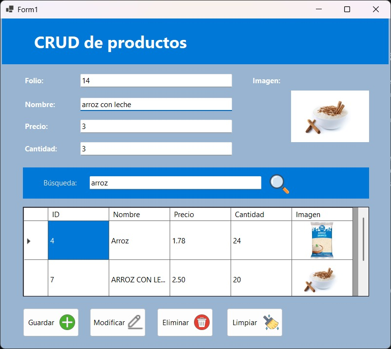

# Laboratorio 4: Base de Datos - CRUD
Fecha: 23/09/2026

## Contenido del Repositorio
Este repositorio contiene la implementación de un sistema de gestión de inventario de productos desarrollado en C# (Windows Forms) conectado a una base de datos relacional MySQL. El sistema permite realizar operaciones completas de CRUD (Crear, Leer, Actualizar, Eliminar), la carga y conversión binaria de imágenes, la aplicación de patrones de diseño mediante interfaces para validaciones polimórficas, y la normalización automática de datos para garantizar la integridad de la información.

## Tecnologías Utilizadas
* **Lenguaje / Framework:** C# (.NET / Windows Forms)
* **Base de Datos:** MySQL / MySQL Workbench
* **Librerías:** `MySql.Data`, `System.Drawing`, `System.Globalization`
* **Entorno de Desarrollo:** Visual Studio 2022
* **Control de Versiones:** Git / GitHub

## Capturas de Pantalla y Problemas

### Interfaz Principal


### Ejercicio 1: Implementación de Operaciones CRUD y Conexión Segura
Se desarrolló la persistencia de datos conectando la aplicación a MySQL a través de métodos seguros en `Conexion.cs`. El sistema permite consultar registros con filtrado en tiempo real, insertar nuevos productos, actualizar registros seleccionados y eliminarlos mediante ventanas de confirmación, manteniendo sincronizado el `DataGridView`.

### Ejercicio 2: Validación Polimórfica mediante Interfaces (`IValidadorCampo`)


Se implementó el contrato de interfaz `IValidadorCampo` para desvincular la lógica de validación de la interfaz gráfica. A través de clases concretas (`ValidadorTexto`, `ValidadorDecimal`, `ValidadorEntero`), los campos del formulario se evalúan de forma masiva en un bucle polimórfico (`foreach`) sin condicionales repetitivos `if/else`.

### Ejercicio 3: Normalización de Datos y Control de Duplicados


Para prevenir inconsistencias y duplicidad de productos:
* **Nombres:** Se convierten automáticamente a mayúsculas sostenidas (`.ToUpper().Trim()`).
* **Precios:** Se redondean a 2 decimales en la capa de datos (`Math.Round`) y se fuerzan visualmente con formato fijo a dos decimales (`F2`).
* **Verificación de Duplicados:** Se implementó una comprobación en memoria previa a la inserción o modificación para bloquear productos repetidos.

### Ejercicio 4: Librería de Gestión de Imágenes (`ImagenHelper`)


Se delegó el procesamiento de imágenes a una clase estática independiente (`ImagenHelper.cs`). Esta librería convierte objetos `Image` a arreglos de bytes (`byte[]`) para su almacenamiento tipo `LONGBLOB` en MySQL, y realiza el proceso inverso (`ByteArrayToImage`) para renderizarlas en el formulario y en la tabla.

## Estructura de Carpetas o Directorio

```plaintext
Laboratorio-4/
│
├── EjemploSProyBD/
│   │
│   ├── bin/                       # Binarios compilados
│   ├── obj/                       # Archivos objetos temporales de compilación
│   ├── Properties/                # Propiedades de la solución y recursos del ensamblado
│   │
│   ├── Conexion.cs                # Clase de capa de datos y consultas SQL parametrizadas
│   ├── EjemploSProyBD.csproj      # Archivo de proyecto de C#
│   ├── EjemploSProyBD.csproj.user # Configuraciones locales de usuario
│   ├── EjemploSProyBD.slnx        # Archivo de solución de Visual Studio
│   ├── Form1.cs                   # Lógica principal de la interfaz gráfica y eventos
│   ├── Form1.Designer.cs          # Código generado automáticamente para el diseño visual
│   ├── Form1.resx                 # Archivo de recursos del formulario
│   ├── ImagenHelper.cs            # Librería estática exclusiva para conversión de imágenes
│   ├── IValidadorCampo.cs         # Interfaz contrato para las reglas de validación
│   ├── Producto.cs                # Modelo de entidad de producto
│   ├── Program.cs                 # Punto de entrada principal de la aplicación
│   └── Validadores.cs             # Clases concretas que implementan IValidadorCampo
│
└── REAMDE.md                      # Documentación principal del repositorio
```

## Instrucciones de Ejecución / Uso

1. **Clonar el repositorio:**
   ```bash
   git clone [https://github.com/jacu2006/Laboratorio-4.git](https://github.com/jacu2006/Laboratorio-4.git)
   ```

2. **Configurar la Base de Datos MySQL:**

* Inicia el servicio de MySQL Server.
* Crea la base de datos productosdb y la tabla productos ejecutando el siguiente script en MySQL Workbench:
  ```bash
  CREATE DATABASE IF NOT EXISTS productosdb;
  USE productosdb;

  CREATE TABLE IF NOT EXISTS productos (
    id INT AUTO_INCREMENT PRIMARY KEY,
    nombre VARCHAR(100) NOT NULL,
    precio DECIMAL(10,2) NOT NULL,
    cantidad INT NOT NULL,
    imagen LONGBLOB
  );
  ```
3. **Configurar la Cadena de Conexión:**

* Revisa la clase Conexion.cs y verifica que los parámetros (Server, Database, Uid, Pwd) coincidan con tu servidor local.

4. **Ejecutar la Aplicación:**

* Abre EjemploSProyBD.slnx o EjemploSProyBD.csproj en Visual Studio 2022.
* Presiona F5 o haz clic en Iniciar para compilar y ejecutar el proyecto.

## Autor y Contexto
* **Nombre:** Javier Alberto Acuña Castro
* **Universidad:** Universidad Tecnológica de Panamá (UTP)
* **Facultad:** Facultad de Ingeniería de Sistemas Computacionales
* **Carrera:** Licenciatura en Ingeniería de Sistemas y Computación
* **Fecha de Realización:** 23/09/2026

## Referencias
* Documentación oficial de C# y Microsoft Docs (.NET Framework & Windows Forms).
* Guía de referencia de MySQL Connector/NET.
* Apuntes de clase y material de apoyo sobre Programación Orientada a Objetos e Interfaces.
